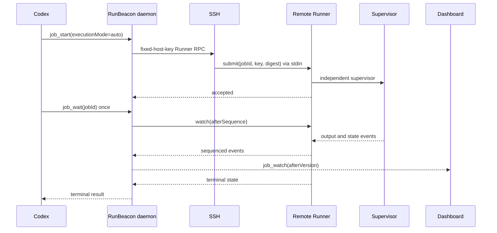

# RunBeacon

RunBeacon is a durable task lifecycle layer for AI agents. Codex starts one local, SSH, Slurm, Apple-signing, or GitHub publishing job, calls `job_wait` once, and resumes after a terminal event. Intermediate monitoring happens in the resident daemon, remote Runner, and single-task dashboard without repeated model turns.

## Components

- `console-automation-mcp@3.0.0`: lifecycle core, MCP server, CLI, credentials, GitHub publishing, policy, audit, and event subscriptions.
- `runbeacon-runner@3.0.0`: signed Linux/macOS x64/arm64 Runner installer. The Go binary requires no remote Node.js and opens no network port.
- `remote-job-monitor@2.0.0`: Codex plugin with MCP App, hooks, and the `monitor-remote-jobs` skill.

Node.js 22 and 24 are supported on Windows, Linux, and macOS coordinators. The remote Runner supports Linux and macOS.

## Durable flow



The command body is sent through SSH stdin. It is not placed in the Runner argv, service definition, snapshot, audit log, or credential profile. A lost submit response is retried only with the same job ID, idempotency key, and command digest. Once the Runner may have accepted a task, RunBeacon never falls back to direct SSH.

## Quick start

```bash
npm ci
npm run build
node dist/mcp/lifecycle-server.js
```

The npm commands are:

- `console-automation-mcp`: lifecycle MCP server
- `remote-job-monitor`: compatibility alias for the same MCP server
- `runbeacon`: interactive jobs, events, approval, audit, policy, doctor, and loopback dashboard CLI

`mcp-console` and the old 40-tool interactive terminal surface moved to `console-automation-mcp-legacy@2.0.x`. They are not present in the 3.0 tarball.

## Job modes

- `auto`: prefer the Runner; use direct SSH only when probing fails before submission and durability is not required.
- `runner`: require a durable Runner.
- `direct`: execute through one SSH channel. This mode is not resumable and cannot verify remote process termination.

Set `requireDurable: true` when an uncertain disconnect is unacceptable. Snapshots expose backend, phase, connection state, durability, resumability, Runner version, reconnect count, and last remote event sequence.

Top-level states are `queued`, `running`, `succeeded`, `failed`, `cancelled`, `timed_out`, and `lost`. A daemon restart reattaches Runner tasks. Non-resumable active jobs become `lost`; RunBeacon never restarts them automatically.

## Runner installation

Runner release assets contain SHA256 checksums, Sigstore bundles, provenance, and an SBOM. Linux installs a user systemd service. macOS installs an Aqua LaunchAgent and must be installed locally in the logged-in GUI session:

```bash
npx runbeacon-runner@3.0.0
```

macOS installation over SSH is rejected. This preserves the GUI user's Keychain context for Developer ID and Notary operations. Uninstall refuses to proceed while any Runner job is active.

Runner state defaults to 7 days and 64 MiB output per task under owner-only directories. Output policy is `tail`, `full`, or `none`.

## MCP tools

RunBeacon retains credential, GitHub publishing, and lifecycle tools and adds:

- `job_watch`: dashboard long poll by local snapshot version
- `runner_manage`: Runner probe; signed installation is interactive CLI-only
- `policy_manage`: inspect/update risk defaults, never approve jobs
- `event_subscription_manage`: Codex, desktop, or HMAC HTTPS webhook subscriptions using environment references for URLs and secrets
- `audit_query`: verified hash-chain audit events

Clients that advertise MCP Tasks can map a RunBeacon job ID directly to an experimental MCP Task and use `tasks/get`, `tasks/result`, `tasks/list`, or `tasks/cancel`. Clients without Tasks keep the same tools. The model-facing completion path remains `job_start -> job_wait`; the MCP App watches only the current job and pauses while hidden.

## Adapters

- `generic`: RE2 progress patterns and bounded `RUNBEACON_EVENT <JSON>` output
- `training`: structured epoch, step, loss, ETA, checkpoint, and GPU fields
- `slurm`: `sbatch --parsable`, `squeue/sacct` status recovery, and verified `scancel`
- `apple-signing`: macOS Aqua Runner preflight for Developer ID identity, untimestamped/timestamped signing, and a Keychain Notary profile

## Policy and audit

Privileged, private-key, release, and destructive commands enter `awaiting_approval`. Approval is bound to the job, command digest, target profile, and risk class for five minutes. The dashboard receives a one-use capability through App-private MCP metadata; it is excluded from model content, snapshots, persistence, and audit. Approval is available only through a user action in the dashboard or interactive CLI:

```bash
runbeacon approve <jobId>
runbeacon reject <jobId>
```

The MCP tool catalog does not expose approval. Audit JSONL files are owner-only and hash chained. They record policy, approval, Runner management, cancellation, publication, terminal state, and event delivery, but never command bodies or credentials.

## Credentials and SSH security

Credential profiles store safe references only. SSH passwords and GitHub PATs are stored through the OS credential helper; private keys remain at referenced paths or in an SSH agent. Inline secrets are memory-only.

Pin `hostKeySha256` and `hostKeyAlgorithm`. Existing profiles without an algorithm can be migrated only after an explicit pinned-fingerprint probe:

```bash
runbeacon runner migrate-host-key --profile <profileId>
```

The MCP equivalent is `runner_manage(action="migrate-host-key", credentialProfile=..., confirm=true)`. A fixed algorithm fails closed and is never replaced after a mismatch. `allowUnverifiedHostKey` is an explicit insecure override and is never selected automatically.

## Configuration migration

Use `RUNBEACON_*` variables. 3.x accepts corresponding `RJM_*` aliases with a deprecation warning; aliases are removed in 4.0. Runtime state defaults to the stable `~/.runbeacon` directory. `PLUGIN_DATA`, `CLAUDE_PLUGIN_DATA`, and `~/.remote-job-monitor` are one-time credential-profile migration sources and never override the canonical directory. Set `RUNBEACON_DATA_DIR` explicitly for an isolated deployment or test; an explicit override does not import home or plugin-host state.

See [Migration to 3.0](docs/MIGRATION_3.0.md) and [Security migration 2.0](docs/SECURITY_MIGRATION_2.0.md).

Stable release operators must configure the three dedicated GitHub runners in
[Self-hosted Stable Acceptance](docs/SELF_HOSTED_ACCEPTANCE.md) before
dispatching the Beta or Stable acceptance workflows.

## Development

```bash
npm run format:check
npm run lint
npm run typecheck
npm run build
npm run test:all

cd runner
go test -race ./...
```

Release promotion is manual. Beta requires green main checks, zero open CodeQL High/Critical alerts, npm and Go vulnerability gates, Linux/macOS Runner tests, four signed assets, Developer ID/Notary validation, exact-workflow Sigstore bundles, provenance, and an SBOM. Stable promotes the tested npm versions only after the same commit has a public Beta for seven complete days and attested Linux training, Mac signing, and fresh Codex-task acceptance all pass.

[](https://m8ven.ai/mcp/liyuchen0118-console-automation-mcp-legacy-r4affg)

## License

MIT
