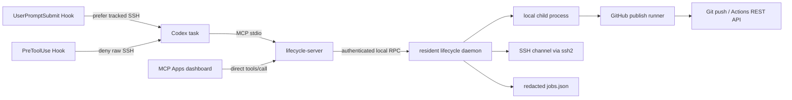
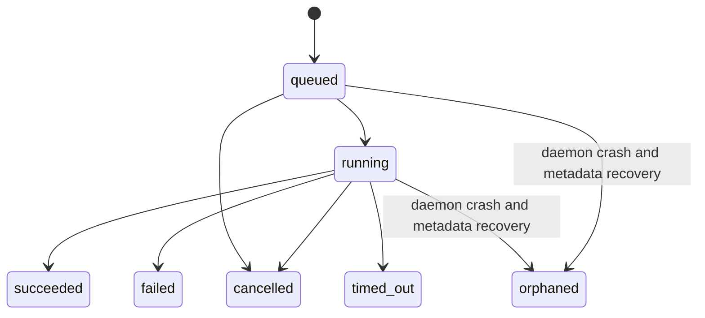

# RunBeacon architecture

## Goals

RunBeacon removes model-driven polling from long-running command workflows. It owns the process or SSH channel, records lifecycle events, exposes bounded state through MCP, and lets Codex block on one long-running `job_wait` call.

## Components



- `src/mcp/lifecycle-server.ts`: MCP tools and dashboard resource.
- `src/daemon/lifecycle-daemon.ts`: resident job owner.
- `src/lifecycle/DaemonClient.ts`: authenticated local RPC and daemon startup.
- `src/lifecycle/LifecycleManager.ts`: queue, execution, events, output ring, progress, cancellation, and assessment.
- `src/lifecycle/JobStore.ts`: atomic redacted metadata persistence.
- `src/lifecycle/DashboardApp.ts`: portable MCP Apps HTML resource.
- `src/daemon/github-publish-runner.ts`: staged-commit, non-force push, and background GitHub Actions monitoring.
- `src/lifecycle/GitHubPublish.ts`: GitHub remote parsing and failure classification.
- `src/lifecycle/CredentialProfileStore.ts`: owner-only, secret-free SSH/GitHub connection references.
- `hooks/route-ssh.cjs`: prevents Codex Bash from bypassing tracking.
- `hooks/route-remote-prompt.cjs`: detects operational remote prompts and injects RunBeacon as the default execution route.

## Lifecycle



`job_wait` registers an in-process listener for a terminal transition. It does not call `job_snapshot` on an interval. Codex's bundled MCP configuration sets `tool_timeout_sec` to 86,400 seconds so the pending tool call can remain idle for a long job.

## Dashboard behavior

`job_dashboard` and `github_publish_start` attach the same `_meta.ui.resourceUri`. The returned HTML initializes the MCP Apps bridge and calls `job_list` directly every 1.5 seconds. GitHub publish cards display remote, branch, Actions-monitoring mode, percentage, phase, full progress message, and bounded output. This is deliberate: the UI gets bounded live state while the model remains asleep. Clients without MCP Apps support can still use every data tool.

## GitHub publish lifecycle

`github_publish_start` starts a normal tracked local job whose executable is the bundled publish runner. The runner validates the Git repository and branch, optionally commits the existing index, runs `git push --progress` without force, and then queries the GitHub Actions REST API by pushed commit SHA.

```mermaid
stateDiagram-v2
  [*] --> preflight
  preflight --> commit: commitMessage and staged changes
  preflight --> push: no commit requested
  commit --> push
  push --> pushed
  pushed --> complete: Actions disabled
  pushed --> actions-discovery: Actions enabled
  actions-discovery --> complete: no run discovered
  actions-discovery --> actions: run discovered
  actions --> complete: all accepted conclusions
  actions --> actions-failed: failed conclusion
  actions --> actions-timeout: deadline reached
```

Each runner phase emits one structured progress line such as `70% [actions] build: in_progress`. `LifecycleManager` parses this into percentage, phase, and a bounded message. Git's own transfer percentages are excluded by the runner-specific progress pattern, preventing object-upload progress from being mistaken for end-to-end completion.

The model may call `job_wait` once to continue after the terminal event. All repeated Actions API checks happen inside the runner. Anonymous access is limited to one request per 60 seconds; authenticated access uses the configured interval with a 10-second floor.

## SSH and credentials

The daemon owns the `ssh2` connection and command channel. The public job record contains only host, port, username, and whether the host key was verified. It never contains password, passphrase, private-key contents, or environment values.

Authentication order is supplied per job:

1. SSH agent path
2. Private key path with optional memory-only passphrase
3. Memory-only password explicitly supplied by the user

Require `hostKeySha256` by default. `allowUnverifiedHostKey` is an explicit insecure override and should only be used with user awareness.

The local daemon RPC uses a random token stored with owner-only permissions under `PLUGIN_DATA`. On Windows it uses a named pipe; on macOS/Linux it uses an owner-only Unix socket.

Passwordless profiles are stored separately as `credential-profiles.json` with owner-only permissions. SSH profiles contain only host, port, username, an agent socket/pipe or private-key path, and host-key verification policy. A profile never accepts passwords, passphrases, tokens, authorization headers, or private-key contents. `job_start` can select a profile explicitly or uniquely match one by host and username.

GitHub profiles point to the standard Git credential helper rather than duplicating its secret store. Pushes use Git normally. The Actions runner invokes `git credential fill` with terminal interaction disabled, keeps the returned password/token only in memory, suppresses both helper output streams, and falls back to anonymous API access when no credential is available.

An optional `githubToken` is sent through daemon RPC and the child environment only. It is not placed in runner arguments, labels, metadata, output, or `jobs.json`. Public repositories do not require a token. Git credential discovery for the push is delegated to Git with terminal prompting disabled, so a missing credential fails visibly instead of hanging an unattended job.

## Persistence boundary

The resident daemon lets jobs survive MCP shim and Codex task restarts. State transitions are persisted immediately while high-frequency output updates are coalesced. Arbitrary metadata and output-derived progress messages are excluded by default; metadata requires `RJM_PERSIST_METADATA=true` and is sanitized before persistence. Output persistence is disabled unless `RJM_PERSIST_OUTPUT=true`, because logs commonly contain secrets. Terminal history is bounded by `RJM_MAX_RETAINED_JOBS` (default 1000).

The MCP shim and daemon perform an explicit lifecycle protocol-version handshake. A mismatched resident daemon is rejected instead of silently serving an updated plugin with old lifecycle semantics.

If the daemon process itself crashes or the machine reboots, local child processes and SSH channels cannot be reattached generically. Previously active records are marked `orphaned` on recovery instead of falsely reported as running.

## Production hardening roadmap

1. Add a platform service installer (Windows service/task, systemd user service, launchd agent).
2. Add remote durable execution adapters (systemd-run, tmux, Slurm, Kubernetes Job) that return a stable remote job identifier.
3. Add callback/webhook completion for remote schedulers; use adaptive daemon-side polling only when the remote system exposes no event channel.
4. Add SSH known_hosts parsing so pinned fingerprints are not the only strict-verification option.
5. Add encrypted credential-profile integration with the OS keychain; never add plaintext secret profiles.
6. Add audit log retention, output redaction policies, and per-host command policy.
7. Add job dependencies and completion actions so multi-step workflows can run entirely inside the daemon when no model reasoning is needed between steps.

## Validation

- `npm run build`: TypeScript build.
- `npx jest src/tests/LifecycleManager.test.ts --runInBand --coverage=false`: lifecycle, timeout, SSH safety, Hook, and UI tests.
- `npm run test:lifecycle:mcp`: real MCP client/server and UI-resource smoke test.
- `src/tests/GitHubPublish.test.ts`: GitHub remote parsing, push failure classification, and accepted Actions conclusions.
- The lifecycle MCP smoke test creates a temporary worktree and local bare remote, then exercises staged commit and push through `github_publish_start` without external credentials.
- `npm run test:lifecycle:daemon`: second-client reattachment to a resident daemon.
- The lifecycle MCP and daemon smoke tests run on Windows, Linux, and macOS in CI.
- `validate_plugin.py`: Codex plugin manifest validation.
- `quick_validate.py`: bundled skill validation.
